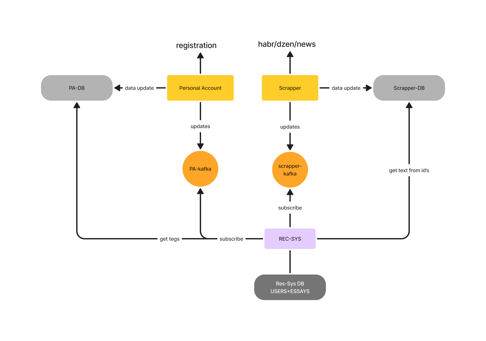

# Recommendations

Сервис для рекомендации статей

## Использование

Имеем как минимум два эндпоинта: 

1. По id пользователя отдаем топ-10 статей:

```
/recommendations/relevant?id=&offset=0
```

2. По введенному тексту находим топ-10 статей:
```
/recommendations/search?text=&offset=0
```

## Архитектура



### Данные 

- Храним у себя одну базу данных: статей. Для обновления подписываемся на кафку для статей: [скраппер](https://github.com/cyberchronicle/Scrapper)

- Для статей - для каждого id храним список слов. При получении новости от кафки скраппера, берем новые статьи из бд скраппера, а именно - текст, выделяем для каждого текста ключевые слова алгоритмом YAKE! и складываем в свои бд. В будущем также получаем эмбеддинг для текста статьи с помощью енкодера


### Рекомендации

При получении запроса на получение рекомендаций для конкретного пользователя, следуем простой логике - смотрим пересечение его тегов, которые он выбрал при регистрации, с каждым списком из нашей таблички статей. Выбираем ненулевые, сортим по кол-ву пересечений. Далее можно сделать опциональный постпроцессинг (Например, учитывать просмотры, лайки или другую информацию, но за ней нужно идти в полную бд статей) Отдаем топ-100 со свдигом, который получили при запросе (конечно везде используем кеш внутри)

### Поиск

Логика идентична предыдущему пункту, но теперь мы (скорее всего) просто сплитим запрос по пробелам, убираем стоп слова и проводим матчинг по этому списку. Более полная логика - получаем эмбеддинг поисковой строки и находим ближайшие статьи по нему

## TEAM

- Лиза Пластинина [@lisaanthro](https://t.me/lisaanthro)
- Саша Гусев [@ZloyLed](https://t.me/ZloyLed)
- Аня Моногарова [@bounsyak](https://t.me/bounsyak)
- Варя Николина [@varya_nikolina](https://t.me/varya_nikolina)
- Катя Горячева [@ktrinkul](https://t.me/ktrinkul)
- Леша Земцов [@zzmtsvv](https://t.me/zzmtsvv)
- Тимур Захаров [@goddesu](https://t.me/goddesu)
- Переверзев Артем [@astifer](https://t.me/astifer)

всем привет друзья
